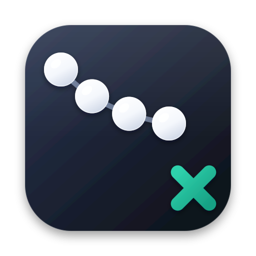

<p align="center">
  
</p>

# vbx — Visual Beads

**Visual Beads for macOS.** A native app for
[beads](https://github.com/steveyegge/beads) issue graphs — a SwiftUI
implementation of [`bv`](https://github.com/Dicklesworthstone/beads_viewer).

`vbx` is the short form: it names the executable, the CLI, the bundle
identifier and the `vbx://` URL scheme. The app itself shows as **Visual
Beads**.

See [docs/VBX_DESIGN.md](docs/VBX_DESIGN.md) for the architecture and
[docs/FEATURE_PARITY.md](docs/FEATURE_PARITY.md) for the capability map.

## The idea in one paragraph

`bv` is ~85k lines of Go: about 34k of Bubble Tea terminal UI and ~50k of
platform-neutral engine (tolerant loading, a two-phase graph analyser computing
nine metrics with per-metric deadlines, git correlation, search, export). `vbx`
**reuses that engine unmodified** — compiled with `go build -buildmode=c-archive`
behind a small C ABI — and replaces only the UI with native Swift. Metrics are
therefore identical to upstream by construction, and tracking a new `bv` release
is a version bump rather than an algorithm re-derivation.


## Build and run

Requires Go 1.25+, Swift 6 / Xcode 16+, macOS 14+.

```bash
./scripts/build-engine.sh --check   # build the Go archive, run the C ABI smoke test
./scripts/build-app.sh --run        # build vbx.app and open the demo fixture
```

`build-app.sh` assembles `.build/vbx.app`. Open it directly, or point it at a
workspace:

```bash
open -a .build/vbx.app --args ~/src/my-project
```

With no argument the app uses `$VBX_WORKSPACE`, then the current directory.

## Distribution builds

Two channels, both driven from the same script:

```bash
./scripts/package-app.sh --check              # what is configured, what is ready
./scripts/build-app.sh --release --dmg        # Developer ID, notarized, stapled .dmg
./scripts/build-app.sh --release --app-store  # sandboxed .pkg for App Store Connect
./scripts/build-app.sh --release --dmg --dry-run   # print the plan, run nothing
```

Signing needs an Apple developer account, and **none of its identifiers are in
this repository** — it is public. Copy the template and fill it in:

```bash
cp scripts/signing.env.example scripts/signing.env   # gitignored
```

Every setting can come from the environment instead, which is what CI should
do. Everything the scripts print is masked, because `codesign -dvvv`,
`security find-identity` and `notarytool` all echo the Team ID and build logs
end up in public issues.

The two channels are not the same app. Developer ID is unsandboxed and keeps
the bundled `vbx-cli` and shell hooks; the App Store build is sandboxed and
drops the CLI, because a sandboxed app cannot install it. See
[ADR-010](docs/project_notes/DECISIONS.md); the secrets design above is
[ADR-009](docs/project_notes/DECISIONS.md).

To try the packaging without certificates, sign ad-hoc — the result runs on
this machine only:

```bash
VBX_DEVELOPER_ID_APP=- ./scripts/build-app.sh --dmg --no-notarize
```

### Notarization credentials

Store them once, interactively. It is deliberately not scripted, because it
takes an app-specific password that must never reach a build script:

```bash
xcrun notarytool store-credentials "vbx-notary" \
    --apple-id you@example.com --team-id ABCDE12345 --password <app-specific>
```

Two failures worth recognising, because neither error text points at its cause:

- **`HTTP status code: 500. Internal Server Error`** — usually malformed input
  rather than an Apple outage. Check `--team-id` is the bare 10-character ID:
  writing `--team-id VBX_TEAM_ID=ABCDE12345`, the `signing.env` form, produces
  exactly this.
- **`HTTP status code: 403. A required agreement is missing or has expired`** —
  the team has not accepted the current Apple Developer Program License
  Agreement, which Apple revises periodically. Sign in at
  [developer.apple.com/account](https://developer.apple.com/account) and accept
  the outstanding agreement, and check App Store Connect → Business →
  Agreements. **Only the Account Holder can accept them** — an Admin cannot.
  The same class of error appears when the membership itself has lapsed.

## Command line

`vbx-cli` links the same engine archive, so its output comes from exactly the
code path the GUI uses.

```bash
swift run vbx-cli --robot-triage   --path Fixtures/demo --pretty
swift run vbx-cli --robot-metrics  --path Fixtures/demo
swift run vbx-cli --robot-unblocks --id vbx-3 --path Fixtures/demo
swift run vbx-cli --robot-plan     --path Fixtures/demo --format toon
swift run vbx-cli --help                       # the full command list
```

Every command is one of bv's `--robot-*` verbs, and
`scripts/parity-check.py` compares the two implementations output by output.

## Tests

```bash
swift test                          # 341 tests: models, query, layout, markdown, engine, store, watch, export, triage, selection, view snapshots
cd Engine/bridge && go test ./...   # 137 tests: loader, analysis dispatch, SQLite, reload gate, history, search, workspaces
./scripts/build-engine.sh --check   # C ABI: lifecycle, error paths, bad handles
./scripts/build-icon.sh --check     # the committed .icns and README PNG are intact
python3 scripts/test-packaging.py   # signing config, output redaction, credential leak scan
python3 scripts/parity-check.py     # vbx-cli against bv, command by command (needs `bv` on PATH)
```

A fresh clone must run `./scripts/build-engine.sh` before `swift test` — the
engine archive is deliberately not committed, and without it the link fails
with `library 'vbxengine' not found`.

## What works today

| Area | Status |
|---|---|
| JSONL and SQLite loading, discovery order, empty-JSONL fallback | ✅ |
| Phase-1 metrics (degree, topological order, density) | ✅ |
| Phase-2 metrics (PageRank, betweenness, HITS, eigenvector, critical path, cycles, k-core, articulation) | ✅ |
| Per-metric status (`computed` / `approx` / `timeout` / `skipped`) surfaced in the UI | ✅ |
| Actionable set, execution plan with parallel tracks, unblocks, blocker chains | ✅ |
| Triage: scored recommendations with reasoning, quick wins, blockers to clear | ✅ |
| List, Board, Graph, Tree, Insights, Plan, Labels views + Inspector | ✅ |
| Markdown rendering of bead descriptions in the inspector | ✅ |
| Filters (open/ready/closed/all), labels, sorting, fuzzy search | ✅ |
| bv's single-key bindings alongside native menu shortcuts | ✅ |
| Offscreen view snapshot tests (no screen-recording permission needed) | ✅ |
| `vbx-cli` with JSON output for agents | ✅ Full robot-protocol coverage, checked against `bv` by `scripts/parity-check.py` |
| Git correlation and the history view | ✅ Reads the object store directly, so it works sandboxed (ADR-006) |
| Markdown report export (Mermaid diagrams, bv-identical) | ✅ |
| Time travel, recipes, sprint dashboard, static-site export | ✅ |
| Live reload via FSEvents, debounced and hash-gated | ✅ |
| Label analytics dashboard (health, velocity, completion) | ✅ |
| Signed distribution: notarized `.dmg`, sandboxed App Store `.pkg` | ✅ |
| Universal binary, Sparkle appcast, Homebrew cask | ❌ Not yet |
| Multi-repo workspaces | ✅ |

## View snapshots

`swift test --filter VBXUITests` renders every view offscreen to PNG and asserts
it actually drew something — ink coverage and colour variety, not just that a
file appeared, since a view that lays out but paints nothing still produces a
valid PNG. Set `VBX_SNAPSHOT_DIR` to keep the images somewhere you can look at
them; they default to a temporary directory.

```bash
VBX_SNAPSHOT_DIR=/tmp/vbx-snaps swift test --filter VBXUITests
open /tmp/vbx-snaps
```

Two things worth knowing if you extend these:

- **Rendering goes through `NSHostingView` in an offscreen window, not
  `ImageRenderer`.** `ImageRenderer` does not lay out `ScrollView` content, so
  every scrolling view renders completely blank through it. Hosting performs a
  real AppKit layout and draw.
- **`.task` and `.onAppear` do not run.** Anything loaded asynchronously will be
  missing from a snapshot, so views should prefer data the store already holds.

## Design rules this codebase follows

1. **No metric is ever computed in Swift.** The engine owns every number; Swift
   does layout and formatting only. Graph *layout* is Swift because it is
   presentation, not analysis.
2. **An unavailable metric is never rendered as zero.** Phase-2 dictionaries are
   absent rather than zero-filled, and the UI shows the metric's status instead.
3. **Decoding never drops data.** Unknown statuses and issue types decode to open
   cases; a dropped issue would silently change every downstream metric.
4. **An empty dependency type blocks**, matching bv's backward-compatibility rule.

## Layout

```
Engine/bridge/       Go module: engine wrapper + C ABI (cbridge)
Engine/smoke/        C ABI smoke test
Sources/CVBXEngine/  C module exposing the generated header
Sources/VBXCore/     Value types, filtering, fuzzy search, graph layout
Sources/VBXEngine/   async/await facade over the C ABI
Sources/VBXAppCore/  ProjectStore — the app's observable state
Sources/vbx/         SwiftUI views
Sources/vbx-cli/     Command line tool
Fixtures/demo/       An 18-bead workspace used by tests and demos
```
