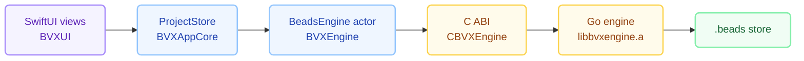

<p align="center">
  
</p>

# bvx

A native macOS app for [beads](https://github.com/steveyegge/beads) issue graphs — a
SwiftUI implementation of [`bv`](https://github.com/Dicklesworthstone/beads_viewer).

See [docs/BVX_DESIGN.md](docs/BVX_DESIGN.md) for the architecture and
[docs/FEATURE_PARITY.md](docs/FEATURE_PARITY.md) for the capability map.

## The idea in one paragraph

`bv` is ~85k lines of Go: about 34k of Bubble Tea terminal UI and ~50k of
platform-neutral engine (tolerant loading, a two-phase graph analyser computing
nine metrics with per-metric deadlines, git correlation, search, export). `bvx`
**reuses that engine unmodified** — compiled with `go build -buildmode=c-archive`
behind a small C ABI — and replaces only the UI with native Swift. Metrics are
therefore identical to upstream by construction, and tracking a new `bv` release
is a version bump rather than an algorithm re-derivation.



## Build and run

Requires Go 1.25+, Swift 6 / Xcode 16+, macOS 14+.

```bash
./scripts/build-engine.sh --check   # build the Go archive, run the C ABI smoke test
./scripts/build-app.sh --run        # build bvx.app and open the demo fixture
```

`build-app.sh` assembles `.build/bvx.app`. Open it directly, or point it at a
workspace:

```bash
open -a .build/bvx.app --args ~/src/my-project
```

With no argument the app uses `$BVX_WORKSPACE`, then the current directory.

## Command line

`bvx-cli` links the same engine archive, so its output comes from exactly the
code path the GUI uses.

```bash
swift run bvx-cli summary --path Fixtures/demo --wait
swift run bvx-cli doctor  --path Fixtures/demo    # end-to-end self check
swift run bvx-cli metrics --path . --wait
swift run bvx-cli unblocks --id bvx-3 --path Fixtures/demo
```

`doctor` exits non-zero if any stage fails, which makes it usable as a CI gate.

## Tests

```bash
swift test                       # 104 tests: models, query, layout, markdown, engine, store, watch, export, triage, view snapshots
cd Engine/bridge && go test ./...  # 16 tests: loader, analysis dispatch, SQLite, reload gate
./scripts/build-engine.sh --check  # C ABI: lifecycle, error paths, bad handles
```

## What works today

| Area | Status |
|---|---|
| JSONL and SQLite loading, discovery order, empty-JSONL fallback | ✅ |
| Phase-1 metrics (degree, topological order, density) | ✅ |
| Phase-2 metrics (PageRank, betweenness, HITS, eigenvector, critical path, cycles, k-core, articulation) | ✅ |
| Per-metric status (`computed` / `approx` / `timeout` / `skipped`) surfaced in the UI | ✅ |
| Actionable set, execution plan with parallel tracks, unblocks, blocker chains | ✅ |
| Triage: scored recommendations with reasoning, quick wins, blockers to clear | ✅ |
| List, Board, Graph, Tree, Insights, Plan, Labels views + Inspector | ✅ |
| Markdown rendering of bead descriptions in the inspector | ✅ |
| Filters (open/ready/closed/all), labels, sorting, fuzzy search | ✅ |
| bv's single-key bindings alongside native menu shortcuts | ✅ |
| Offscreen view snapshot tests (no screen-recording permission needed) | ✅ |
| `bvx-cli` with JSON output for agents | Partial — a subset of bv's robot commands |
| Git correlation / history view | ❌ Not yet wired to the UI |
| Markdown report export (Mermaid diagrams, bv-identical) | ✅ |
| Time travel, recipes, sprint dashboard, static-site export | ❌ Not yet |
| Live reload via FSEvents, debounced and hash-gated | ✅ |
| Label analytics dashboard (health, velocity, completion) | ✅ |
| Multi-repo workspaces | ❌ Not yet |

## View snapshots

`swift test --filter BVXUITests` renders every view offscreen to PNG and asserts
it actually drew something — ink coverage and colour variety, not just that a
file appeared, since a view that lays out but paints nothing still produces a
valid PNG. Set `BVX_SNAPSHOT_DIR` to keep the images somewhere you can look at
them; they default to a temporary directory.

```bash
BVX_SNAPSHOT_DIR=/tmp/bvx-snaps swift test --filter BVXUITests
open /tmp/bvx-snaps
```

Two things worth knowing if you extend these:

- **Rendering goes through `NSHostingView` in an offscreen window, not
  `ImageRenderer`.** `ImageRenderer` does not lay out `ScrollView` content, so
  every scrolling view renders completely blank through it. Hosting performs a
  real AppKit layout and draw.
- **`.task` and `.onAppear` do not run.** Anything loaded asynchronously will be
  missing from a snapshot, so views should prefer data the store already holds.

## Design rules this codebase follows

1. **No metric is ever computed in Swift.** The engine owns every number; Swift
   does layout and formatting only. Graph *layout* is Swift because it is
   presentation, not analysis.
2. **An unavailable metric is never rendered as zero.** Phase-2 dictionaries are
   absent rather than zero-filled, and the UI shows the metric's status instead.
3. **Decoding never drops data.** Unknown statuses and issue types decode to open
   cases; a dropped issue would silently change every downstream metric.
4. **An empty dependency type blocks**, matching bv's backward-compatibility rule.

## Layout

```
Engine/bridge/       Go module: engine wrapper + C ABI (cbridge)
Engine/smoke/        C ABI smoke test
Sources/CBVXEngine/  C module exposing the generated header
Sources/BVXCore/     Value types, filtering, fuzzy search, graph layout
Sources/BVXEngine/   async/await facade over the C ABI
Sources/BVXAppCore/  ProjectStore — the app's observable state
Sources/bvx/         SwiftUI views
Sources/bvx-cli/     Command line tool
Fixtures/demo/       An 18-bead workspace used by tests and demos
```
