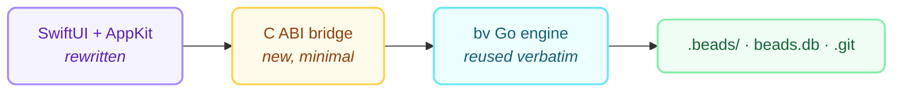

# bvx Documentation

**bvx** is a native macOS implementation of [`bv` (Beads Viewer)](https://github.com/Dicklesworthstone/beads_viewer) —
a dependency-graph-aware viewer for **beads** issue stores.

Where `bv` is a Bubble Tea terminal UI, `bvx` is a SwiftUI/AppKit application: document-based,
multi-window, menu-driven, with hit-testable graph rendering and native charts. It keeps the
same functionality, the same metrics, and the same agent-facing JSON protocol.

## Documents

| Document | What it covers |
|---|---|
| [**bvx Design Document**](BVX_DESIGN.md) | The full architecture: engine reuse decision, C ABI bridge, data model, analysis pipeline, UI design, graph rendering, robot protocol, build and distribution, delivery plan, risks |
| [**Feature Parity Matrix**](FEATURE_PARITY.md) | Every `bv` capability mapped to its `bvx` surface, mechanism, and delivery phase — plus the deliberate divergences |

## The one-paragraph version

`bv` is about 85,000 lines of Go, of which roughly 34,000 are terminal UI and 50,000 are a
platform-neutral engine: tolerant JSONL/SQLite loading, a two-phase graph analyser computing
nine metrics with per-metric deadlines and status reporting, git↔bead correlation, search,
and export. `bvx` **reuses that engine unmodified** — compiled with `go build -buildmode=c-archive`
and packaged as `BeadsEngine.xcframework` behind a deliberately tiny C ABI — and replaces only
the UI layer with native Swift. That gives exact numerical parity with upstream by construction,
makes tracking new `bv` releases a submodule bump, and confines new code to the part that
actually benefits from being native.



## Reading order

1. [Design doc §1–4](BVX_DESIGN.md#1-summary) — what `bv` is and why the engine is reused
2. [§5–9](BVX_DESIGN.md#5-system-architecture) — architecture, bridge, model, data flow
3. [§10–12](BVX_DESIGN.md#10-user-interface-design) — the UI, graph rendering, search
4. [§13–17](BVX_DESIGN.md#13-robot-protocol-cli-and-automation) — agents, exports, performance, testing, distribution
5. [§18–20](BVX_DESIGN.md#18-delivery-plan) — plan, risks, open questions
6. [Parity matrix](FEATURE_PARITY.md) — the checklist

## Static HTML

A rendered, self-contained HTML version of these documents lives in [`html/`](html/index.html).
Regenerate it with:

```bash
python3 scripts/build-docs.py
```
